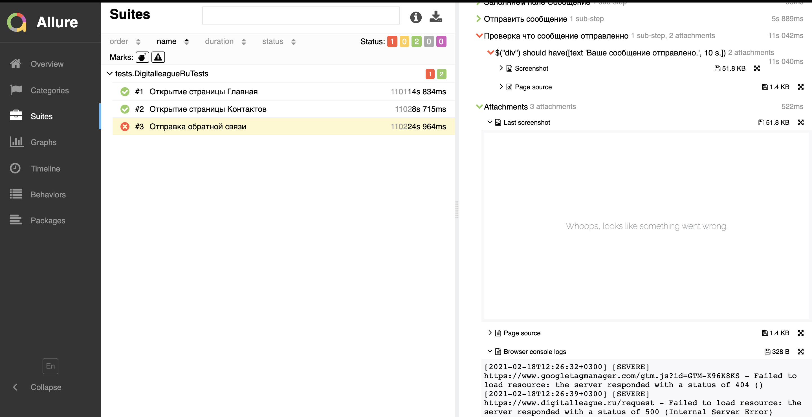

## Для автотестов был использован сайт `ЛИГА ЦИФРОВОЙ ЭКОНОМИКИ`  `https://www.digitalleague.ru/`

## Баг репорт

`Priority`
N/A

`Severity`
Major

`Summary`

Ошибка 500 при отправке формы ‘Свяжитесь с нами’ на странице Ждем в гости.

`Steps to reproduce`

        1. Открыть https://www.digitalleague.ru/
        2. Перейти в вкладку Ждем в гости

        3. Заполнить форму Свяжитесь с нами 
        3.1 Поле «Имя» - Евгений
        3.2 Поле «Телефон или почта» - 9031112233
        3.3 Поле «Сообщение» - Какой то баг

        4. Нажать кнопку Отправить

`Actual result`

500 Internal Server Error.

`Expected result`

Ваше сообщение отправленно

`Build version`

N/A

`Platform`

        WEB
        Google Chrome
        Версия 88.0.4324.150 (Официальная сборка), (x86_64)
        Safari
        Версия 14.0.2 (16610.3.7.1.9)

        Mobile
        HONOR P20 Pro
        Android 10; YAL-L41 Build/HUAWEIYAL-L41

`Attachment`
